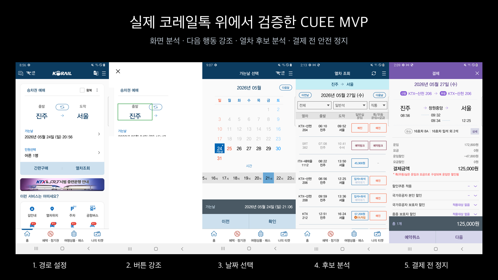

# CUEE

> 코레일톡에서 다음에 눌러야 할 곳만 보여 주는 Android 접근성 가이드 MVP

CUEE는 코레일톡을 대신 조작하거나 예매하지 않습니다. 화면 위에 **지금 직접 눌러야 할 영역만 강조**해 사용자가 스스로 예매 흐름을 이어가게 돕습니다. 로그인·개인정보·결제처럼 민감한 화면에서는 안내를 멈춥니다.



## 무엇을 할 수 있나요?

- 코레일톡(`com.korail.talk`) 화면 위에 이동 가능한 CUEE 버튼을 표시합니다.
- 음성 명령을 받아 다음 행동 영역을 초록색으로 강조합니다.
- MVP 데모에서는 `진주 → 서울`, 어른 2명·어린이 1명 조건의 열차 검색을 안내합니다.
- 화면에 보이는 직접 예매 가능한 후보만 추천하고, 사용자가 직접 선택·예매·결제합니다.
- 로그인, 인증, 개인정보, 최종 확인, 결제 화면에서는 안전 안내 후 멈춥니다.

## 동작 원리

```text
사용자 음성 명령
  → Android 접근성 서비스가 현재 코레일톡 화면 구조를 읽음
  → 다음에 눌러야 할 안전한 영역을 판단
  → 나머지 화면을 가리고 해당 영역만 강조
  → 사용자가 직접 탭
```

CUEE가 자동으로 입력할 수 있는 범위는 역 검색어 입력뿐입니다. 열차 선택, 예매, 약관, 개인정보, 결제는 자동 탭하지 않습니다.

## 빠르게 실행하기

### 1. 준비물

- Android Studio (권장) 또는 Android SDK/ADB
- JDK 17
- Android 10(API 29) 이상 실제 기기 또는 에뮬레이터
- 테스트하려면 설치 및 로그인된 코레일톡 앱

이 프로젝트는 API 키, 서버, `.env` 파일이 필요 없습니다. `compileSdk 36`, `targetSdk 36`, `minSdk 29`로 빌드합니다.

### 2. 프로젝트 받기와 빌드

```bash
git clone https://github.com/gyutaetae/cuee.git
cd cuee
./gradlew test
./gradlew assembleDebug
```

Windows PowerShell에서는 `./gradlew.bat test`, `./gradlew.bat assembleDebug`를 사용합니다. 빌드 결과물은 `app/build/outputs/apk/debug/app-debug.apk`에 생성됩니다.

### 3. 기기에 설치

Android Studio에서 프로젝트를 열어 `app` 구성을 실행하거나, USB 디버깅이 켜진 기기에 아래 명령으로 설치합니다.

```bash
./gradlew installDebug
adb shell am start -n com.cuee/.ui.MainActivity
```

### 4. 처음 한 번 설정

1. CUEE가 어떤 화면 정보와 음성을 처리하는지 읽고 동의 여부를 선택합니다.
2. `접근성 설정 열기`를 누릅니다.
3. Android 설정에서 **큐** 접근성 서비스를 켭니다.
4. 음성 명령을 사용할 때만 `마이크 권한 허용`을 누릅니다.
5. `코레일+ 열기`를 누르면 화면 가장자리에 CUEE 버튼이 나타납니다.

> 접근성 서비스는 코레일톡 화면에서 다음 행동 위치를 찾는 데에만 사용합니다. 화면 원문과 음성 원문은 저장하지 않습니다.

개인정보 처리방침 초안과 Play Console 제출 준비 자료는 [`docs/privacy-policy.md`](docs/privacy-policy.md)와 [`docs/release-checklist.md`](docs/release-checklist.md)에 있습니다.

## 사용 플레이북

### A. 전체 데모: 진주에서 서울로 예매 흐름 안내

사전 조건: 코레일톡 로그인 후 **승차권 예매 홈 화면**에 있어야 합니다.

1. 코레일톡의 CUEE 버튼을 누릅니다.
2. 다음처럼 말합니다: **“진주에서 서울 가는 표 예매해줘”**
3. 초록색으로 강조된 출발역 영역을 직접 누릅니다.
4. CUEE가 `진주`와 `서울` 검색을 돕고, 날짜·시간·인원을 차례로 안내합니다.
5. `열차조회`를 직접 누릅니다.
6. CUEE가 현재 보이는 열차 중 직접 예매 가능한 후보를 강조하면, 원하는 후보를 직접 선택합니다.
7. `예매`와 결제 진입도 직접 누릅니다. 결제 단계에서는 CUEE가 안전 안내 후 종료됩니다.

기본 데모 조건은 내일 06:00 이후, 어른 2명, 어린이 1명입니다. 바로 예매 가능한 좌석이 없으면 내일 시간 전체 → 다음 날 06:00 이후 → 다음 날 시간 전체 순서로 검색 범위를 넓힙니다.

### B. 짧은 안내 명령

코레일톡 화면에서 CUEE 버튼을 누른 뒤 다음 표현도 사용할 수 있습니다.

- `승차권 예매 찾기`
- `예매한 표 보여줘`

지원 범위는 현재 코레일톡 단일 MVP입니다. 다른 앱·임의의 경로·날짜·인원을 해석하는 범용 비서는 아닙니다.

### C. 멈추거나 다시 시작하기

- 강조가 잘못되었거나 화면이 바뀌면 CUEE 버튼을 다시 눌러 새 안내를 시작합니다.
- 로그인, 인증, 개인정보, 결제·발권 화면은 사용자가 직접 확인해야 하며 CUEE가 안내를 중지합니다.
- 버튼이 보이지 않으면 CUEE 앱에서 접근성 서비스와 `큐 버튼 켜기` 상태를 다시 확인합니다.

## 개발 및 검증

```bash
# JVM 단위 테스트
./gradlew test

# 디버그 APK 빌드
./gradlew assembleDebug

# 연결된 기기에 설치
./gradlew installDebug
```

실제 코레일톡 연동 스모크 테스트에는 Maestro와 ADB를 사용합니다. Windows 환경용 보조 스크립트는 다음과 같습니다.

```powershell
./scripts/run_maestro_e2e.ps1 -Mode Actual
```

실제 서비스 화면은 버전에 따라 달라질 수 있으므로, 테스트 전 로그인 상태와 화면 구성을 확인하세요. 테스트 중에도 실제 예매·결제 확정은 사람이 직접 판단하고 수행해야 합니다.

### Android 에뮬레이터 전체 E2E

휴대폰이나 코레일 계정 없이 재현 가능한 전체 흐름은 전용 Android 에뮬레이터에서 검증합니다. `mock-korail`은 실제 코레일톡과 같은 패키지명(`com.korail.talk`)으로 고정된 화면을 제공하고, CUEE의 실제 APK·접근성 서비스·오버레이가 진주 → 서울 흐름을 끝까지 안내하는지 확인합니다.

```bash
./gradlew test assembleDebug
python3 scripts/run_android_demo_e2e.py --adb adb
```

테스트는 출발역, 도착역, 내일 06:00, 어른 2명·어린이 1명, 열차 추천과 예매 진입을 거쳐 결제 화면에서 안전하게 멈추지 않으면 실패합니다. 이는 CUEE 자체의 재현 가능한 전체 E2E 증거이며, 실제 코레일톡 최신 버전이나 실서비스 좌석·예매 성공을 증명하지는 않습니다.

## 프로젝트 구조

```text
app/src/main/java/com/cuee/
├── service/        접근성 이벤트와 전체 안내 흐름
├── accessibility/  Android 화면 노드 → 테스트 가능한 화면 스냅샷
├── domain/         명령 해석, 안전 정책, 상태 전이, 후보 점수화
├── overlay/        버튼, 마스크, 강조 표시
├── speech/         음성 인식과 TTS
└── ui/             초기 설정과 CUEE 버튼 제어

docs/               제품 요구사항, 흐름, 설계 결정
maestro/            화면 스모크 테스트 흐름
mock-korail/        재현 가능한 에뮬레이터 E2E용 화면
scripts/            전체 E2E 실행 및 보조 스크립트
artifacts/          데모 영상·스크린샷·온라인 전시 자료
```

## 데모 자료

- [20초 진주 → 서울 E2E 데모 영상](artifacts/cuee-jinju-seoul-e2e-demo-20s.mp4)
- [결제 전 안전 종료 화면](artifacts/screenshots/cuee-emulator-e2e/16-payment-safety-stop.png)
- [온라인 전시 자료](artifacts/online-exhibition/CUEE_U300_온라인전시관_최종.pdf)
- [제품 흐름](docs/flow.md)
- [제품 요구사항](docs/prd.md)
- [코드 구조](docs/code-architecture.md)

## 안전 원칙

CUEE는 접근성을 높이기 위한 보조 도구입니다. 사용자의 선택권을 보존하기 위해 다음을 지킵니다.

- 자동 예매·자동 결제·로그인 자동화를 하지 않습니다.
- 민감 정보와 결제 화면에서는 안내를 중단합니다.
- 추천은 현재 화면에 보이는 후보에 한정되며, 최종 선택과 거래 책임은 사용자에게 있습니다.

20초 영상은 전용 Android 에뮬레이터에서 실제 CUEE APK와 접근성 서비스를 실행해 녹화했습니다. 상대 앱은 재현 가능한 `mock-korail`이므로 실제 코레일톡 서비스 연동 증거와는 구분됩니다.
